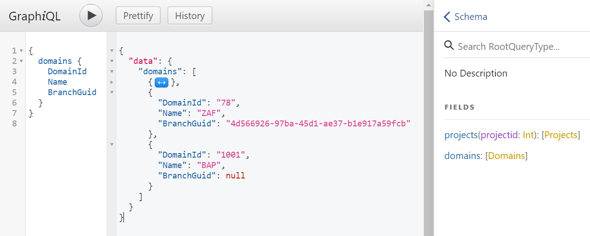

# snipeit-graphql

graphql 
  * https://graphql.org/ 
  * https://github.com/graphql/graphql-js
  
mysql2 
  * https://www.npmjs.com/package/mysql2

git clone this repo

cd to snipeit-graphql

npm i

npm start
or npm run dev (using nodemon)

